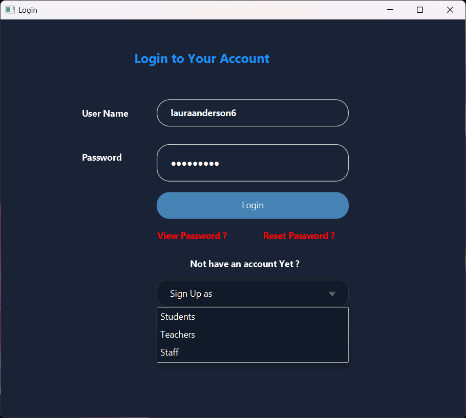
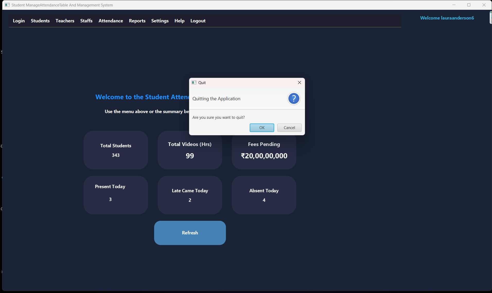
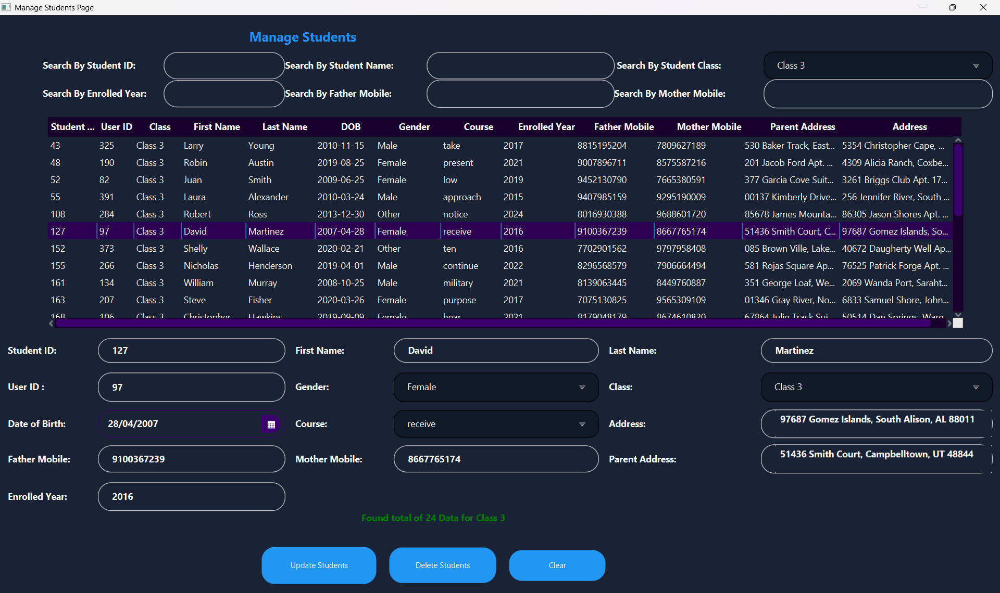
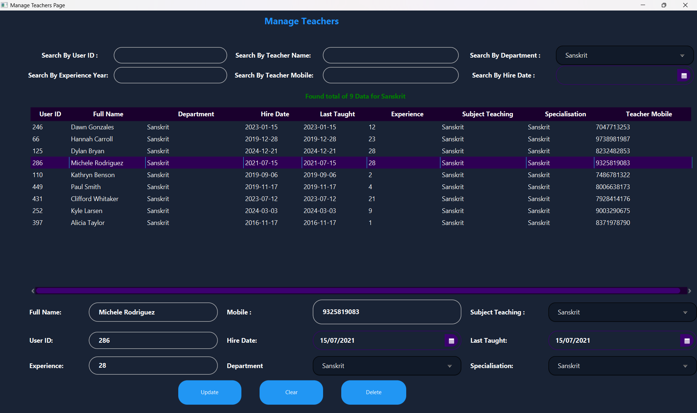
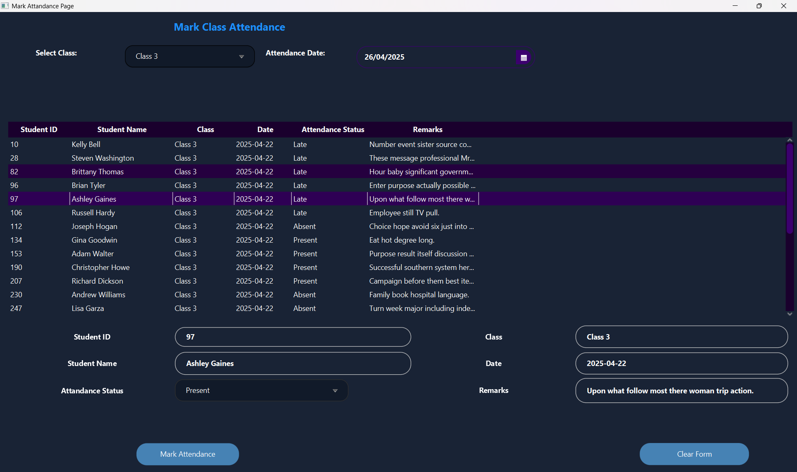
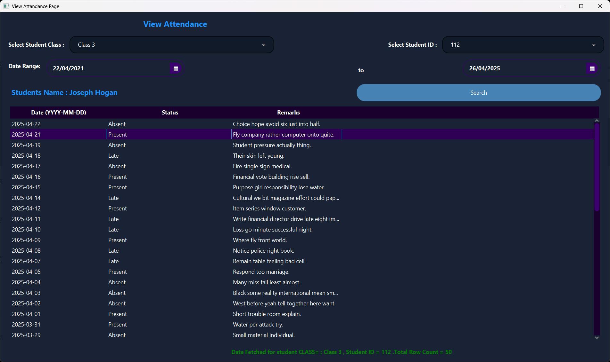
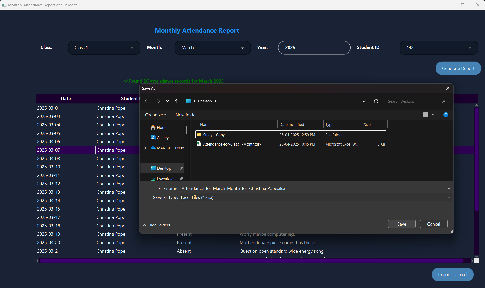
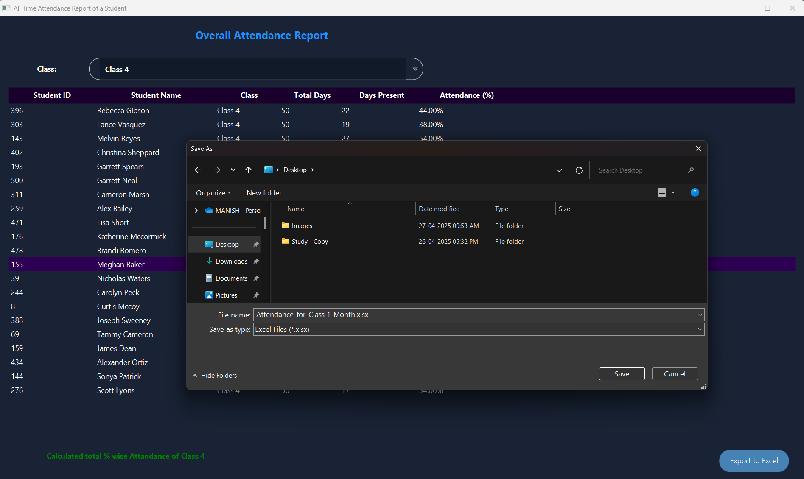

# 📘 School Attendance Management System


> A powerful, modern, and feature-rich **School Attendance Management System** developed in **JavaFX + MySQL**.  
> This system is perfect for managing student and teacher attendance with a sleek dashboard, detailed reports, and role-based access control. It also supports theme switching, font customization, and responsive layouts.

---

## 🖼️ Preview

| Login | Dashboard | Logout |
|-------|-----------|--------|
|  |  |  |

| Manage Students | Manage Teachers | Mark Attendance |
|-----------------|-----------------|-----------------|
|  |  |  |

| View Attendance | Monthly Report | Overall Report |
|-----------------|----------------|----------------|
|  |  |  |

---

## 🚀 Features

✨ **Secure Login System**  
🔐 Role-based access for Admins, Teachers & Staff  
📋 **Student & Teacher Attendance** (Class-wise and Individual)  
📊 **Detailed Reports** (Monthly, Overall, Custom Date Range)  
🎨 **UI Customization** (Dark/Light Theme, Font Name & Size)  
🗃️ **MySQL Database Integration** (Live Sync, Optimized Queries)  
🧠 **Modern JavaFX UI** (Modular, FXML-based, Clean UX)

---

## 🔧 Technologies Used

| Tech Stack     | Description                                  |
|----------------|----------------------------------------------|
| JavaFX         | Frontend - Modern UI toolkit for Java        |
| MySQL          | Backend - Relational Database System         |
| FXML/CSS       | UI Layout & Styling                          |
| JDBC           | Java-MySQL connectivity                      |

---

## 📂 Project Structure

```bash
📁 School-Attendance-Management-System/
├── 📁 src/
│   ├── 📁 controllers/
│   ├── 📁 models/
│   ├── 📁 dao/
│   ├── 📁 utils/
│   └── MainApplication.java
├── 📁 resources/
│   ├── 📁 fxml/
│   ├── 📁 images/
│   └── 📄 styles.css
├── 📁 database/
│   └── school_attendance.sql
└── README.md
